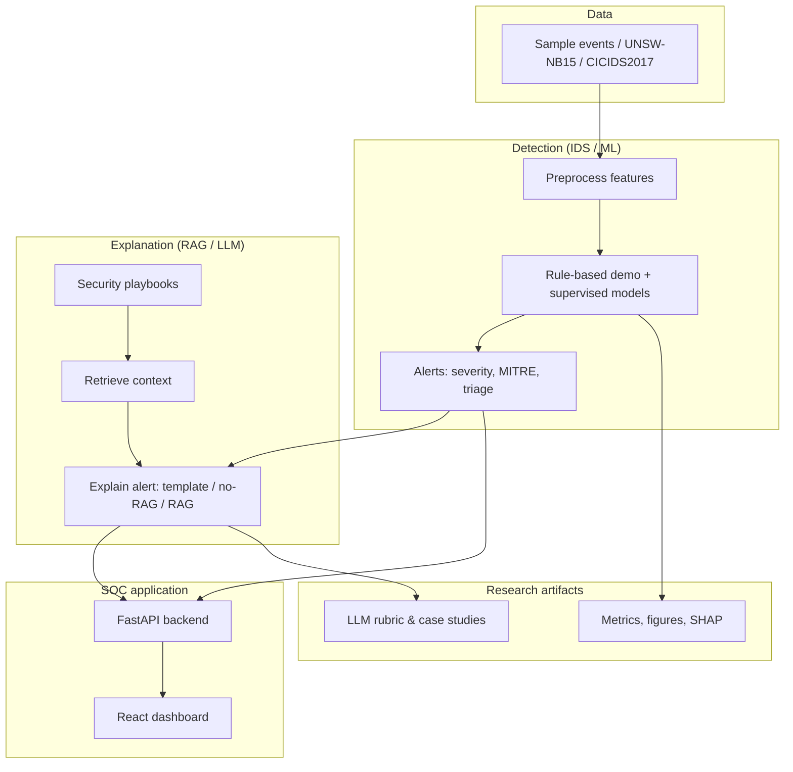

# LLM-Assisted Intrusion Detection SOC

The system demonstrates a mini Security Operations Center (SOC) workflow: network-flow events are loaded, suspicious activity is converted into IDS alerts, ML evaluation artifacts are generated, and an LLM-style assistant explains alerts with security playbook context.

## Why This Project Exists

Traditional IDS and ML-based detectors can identify suspicious traffic, but their outputs are often difficult for analysts to triage quickly. This project explores how a detection engine can be combined with explainability features and retrieval-augmented alert explanations.

The thesis focus is not to let an LLM decide whether traffic is malicious. The IDS/ML layer performs detection and classification. The LLM/RAG layer supports analysts by explaining evidence, mapping alerts to security knowledge, and recommending response steps.

## Core Capabilities

- Load sample IDS-style network-flow events.
- Generate rule-based demo alerts for attacks such as brute force, DDoS, and port scanning.
- Register research datasets such as sample data, UNSW-NB15, and CICIDS2017.
- Preprocess UNSW-NB15-style CSV files for model training.
- Train baseline ML models including Logistic Regression, Decision Tree, and Random Forest.
- Export model metrics, model comparison tables, confusion matrix figures, and feature importance artifacts.
- Display SOC dashboard cards, alert tables, ML metrics, and LLM explanations.
- Map alerts to MITRE ATT&CK-style techniques and triage priority values.
- Compare explanation modes: template, no-RAG, and RAG-assisted explanations.
- Export LLM rubric scores, RAG summaries, and incident case study reports for thesis evaluation.

## Architecture Overview

The system is designed as a clear SOC-style pipeline: **ML/IDS detects suspicious activity, while RAG/LLM explains the alert and supports analyst triage**.



**Read top to bottom:** data is preprocessed and detected; alerts are explained with playbooks; the dashboard shows both. Metrics and LLM scores are research exports, not the live detector.

Detailed diagrams (evaluation pipeline, analyst workflow) are in [`docs/architecture-diagram.md`](docs/architecture-diagram.md).

### Component Map

- **Backend**: FastAPI service that exposes events, alerts, explanations, datasets, and metrics.
- **Frontend**: React + Vite dashboard for viewing alerts, model metrics, and explanation comparisons.
- **Scripts**: CLI tools for preprocessing, model training, evaluation export, and report generation.
- **Knowledge base**: Local markdown playbooks used as grounding context for alert explanations.
- **Artifacts**: Generated model metrics, trained models, figures, and evaluation reports.

## Repository Structure

```text
.
├── backend/                 # FastAPI application, domain models, services, tests
├── data/                    # Sample and processed IDS datasets
├── docs/                    # Thesis outline, roadmap, evaluation plan, design notes
├── frontend/                # React/Vite SOC dashboard
├── knowledge_base/          # Local security playbooks for RAG-style grounding
├── models/                  # Generated metrics and trained model artifacts
├── reports/                 # Generated evaluation reports and figures
├── scripts/                 # Preprocessing, training, and export CLIs
├── .gitignore               # Excludes local envs, dependencies, generated data/artifacts
└── README.md
```

## Tech Stack

- **Backend**: Python, FastAPI, Pydantic, pandas, scikit-learn, joblib, pytest.
- **Frontend**: React, TypeScript, Vite.
- **ML/IDS**: rule-based baseline plus baseline supervised models for research comparison.
- **LLM/RAG**: local template, optional OpenAI / Gemini / Ollama, and markdown playbook retrieval (TF-IDF or embeddings).
- **Research outputs**: CSV, JSON metrics, markdown reports, and figure exports.

## Quick Start

### 1. Start the Backend

```bash
cd backend
python -m venv .venv
source .venv/bin/activate
pip install -r requirements.txt
uvicorn app.main:app --reload
```

### 2. Start the Frontend

Open a second terminal:

```bash
cd frontend
npm install
npm run dev
```

Frontend default URL:

```text
http://localhost:5173
```

The dashboard calls the backend at `http://localhost:8000`. If the backend is offline, the frontend falls back to sample dashboard data.

### 3. Run Backend Tests

```bash
cd backend
pytest
```

## API Overview

The FastAPI backend currently exposes these main endpoints:

| Method | Endpoint | Purpose |
| --- | --- | --- |
| `GET` | `/health` | Service health check. |
| `GET` | `/events` | Return sample network-flow events. |
| `GET` | `/datasets` | List supported/registered datasets. |
| `GET` | `/alerts` | Generate demo IDS alerts from sample events. |
| `GET` | `/alerts/{alert_id}` | Get one alert by ID. |
| `GET` | `/alerts/{alert_id}/explanation` | Explain one alert with local LLM/RAG-style context. |
| `GET` | `/alerts/{alert_id}/explanation/comparison` | Compare template, no-RAG, and RAG-style explanations. |
| `GET` | `/metrics` | Return fixed demo IDS metrics. |
| `GET` | `/ml/evaluate` | Evaluate the rule-based baseline on sample events. |
| `GET` | `/ml/metrics` | Return saved ML metric artifacts. |

FastAPI also provides interactive API documentation when the backend is running:

```text
http://localhost:8000/docs
```

## Main Research Workflows

Run these commands from the repository root unless noted otherwise.

### Run End-To-End Dataset Pipeline

Validate raw benchmark CSV files before running the full pipeline:

```bash
backend/.venv/bin/python scripts/validate_dataset.py \
  --input data/raw/UNSW_NB15_training-set.csv \
  --output reports/evaluation/unsw-nb15-validation.json \
  --min-rows 1000
```

See `docs/datasets.md` for dataset source, placement, validation, and reporting guidance.

```bash
backend/.venv/bin/python scripts/run_dataset_pipeline.py \
  --dataset-id fixture-pipeline \
  --input data/samples/unsw_nb15_fixture.csv \
  --output-dir reports/pipeline/fixture-pipeline \
  --models decision_tree \
  --test-size 0.33 \
  --random-state 42
```

For benchmark datasets with official train/test files, keep the published split instead of generating a new random split:

```bash
backend/.venv/bin/python scripts/run_dataset_pipeline.py \
  --dataset-id unsw-nb15-official \
  --train-input data/raw/UNSW_NB15_training-set.csv \
  --test-input data/raw/UNSW_NB15_testing-set.csv \
  --output-dir reports/pipeline/unsw-nb15-official \
  --models logistic_regression,decision_tree,random_forest
```

This runs the research workflow in one command: profile dataset, create or record the train/test split, preprocess both splits, train models, evaluate on the test split, and export artifacts under the selected output directory. It also writes `pipeline-report.md`, a thesis-ready summary of dataset profile, split setup, model metrics, and generated artifact paths, plus `reports/model-comparison.csv`, confusion matrix SVG figures, and tree-model feature importance CSV files compatible with the standard evaluation workflow.

### Profile An IDS Dataset CSV

```bash
backend/.venv/bin/python scripts/profile_dataset.py \
  --input data/samples/unsw_nb15_fixture.csv \
  --output reports/evaluation/dataset-summary.json
```

This creates a JSON summary with row count, column count, labels, attack categories, class percentages, imbalance ratios, missing values, and column names. Use this before preprocessing a full benchmark dataset.

### Split An IDS Dataset CSV

```bash
backend/.venv/bin/python scripts/split_dataset.py \
  --input data/samples/unsw_nb15_fixture.csv \
  --train-output data/processed/unsw_nb15_fixture_train.csv \
  --test-output data/processed/unsw_nb15_fixture_test.csv \
  --summary-output reports/evaluation/dataset-split-summary.json \
  --test-size 0.33 \
  --random-state 42
```

This creates train/test CSV files and a split summary containing row counts, split strategy, stratification status, and label distribution for each split. If stratified splitting is not possible because the dataset is too small or a class has too few samples, the script falls back to a non-stratified split and records that in the summary.

### Preprocess UNSW-NB15 Fixture Data

```bash
python scripts/preprocess_unsw_nb15.py \
  --input data/samples/unsw_nb15_fixture.csv \
  --output data/processed/unsw_nb15_fixture_processed.csv
```

### Train Baseline Models

```bash
backend/.venv/bin/python scripts/train_models.py \
  --dataset-id fixture \
  --input data/processed/unsw_nb15_fixture_processed.csv \
  --metrics-dir models/metrics \
  --models-dir models/trained
```

### Train Baseline Models With Explicit Train/Test Files

```bash
backend/.venv/bin/python scripts/train_models.py \
  --dataset-id fixture-split \
  --train-input data/processed/unsw_nb15_fixture_train.csv \
  --test-input data/processed/unsw_nb15_fixture_test.csv \
  --metrics-dir models/metrics \
  --models-dir models/trained
```

Use this mode for thesis-grade experiments because metrics are calculated on the explicit test split rather than the same CSV used for training.

### Export Model Comparison CSV

```bash
backend/.venv/bin/python scripts/export_model_comparison.py \
  --metrics-dir models/metrics \
  --output reports/evaluation/model-comparison.csv
```

### Export Confusion Matrix Figures

```bash
backend/.venv/bin/python scripts/export_confusion_matrices.py \
  --metrics-dir models/metrics \
  --figures-dir reports/figures
```

### Export Feature Importance

```bash
backend/.venv/bin/python scripts/export_feature_importance.py \
  --dataset-id fixture \
  --input data/processed/unsw_nb15_fixture_processed.csv \
  --models-dir models/trained \
  --output-dir reports/evaluation/feature-importance
```

### Evaluate LLM Explanation Modes

```bash
backend/.venv/bin/python scripts/evaluate_llm.py \
  --output reports/evaluation/llm-rubric-scores.csv
```

### Export RAG vs No-RAG Summary

```bash
backend/.venv/bin/python scripts/export_rag_summary.py \
  --scores reports/evaluation/llm-rubric-scores.csv \
  --output reports/evaluation/rag-vs-no-rag-summary.md
```

### Export Incident Case Studies

```bash
backend/.venv/bin/python scripts/export_case_studies.py \
  --output reports/evaluation/incident-case-studies.md
```

## Evaluation Plan

IDS model evaluation is designed around common supervised-learning metrics:

- Accuracy.
- Precision.
- Recall.
- F1-score.
- False positive rate.
- Confusion matrix.
- Training and prediction cost where applicable.

LLM/RAG explanation evaluation is designed around a rubric:

- Correctness: the explanation matches the alert and evidence.
- Completeness: it includes cause, impact, and response guidance.
- Groundedness: it stays within the alert and retrieved context.
- Actionability: recommendations are concrete and feasible.
- Hallucination control: it avoids invented facts, tools, IPs, or CVEs.
- Latency: response time is acceptable for analyst workflow.

See `docs/evaluation-plan.md` for more detail.


