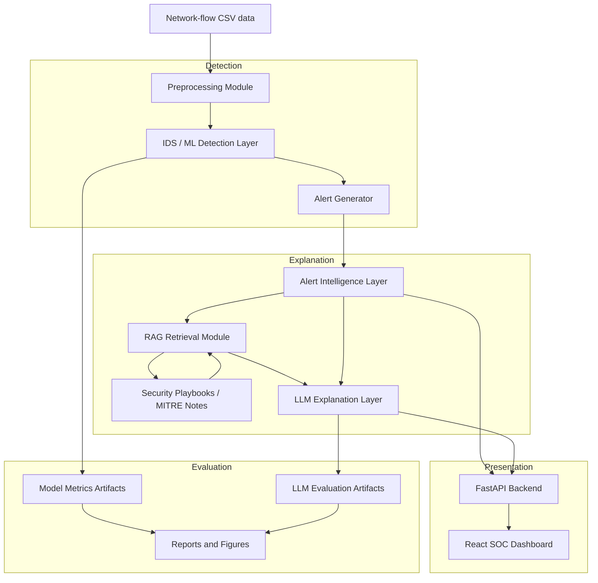
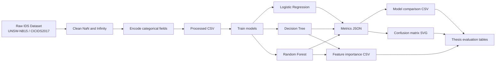
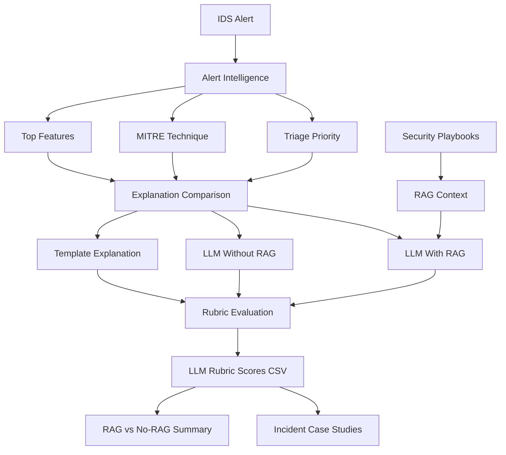
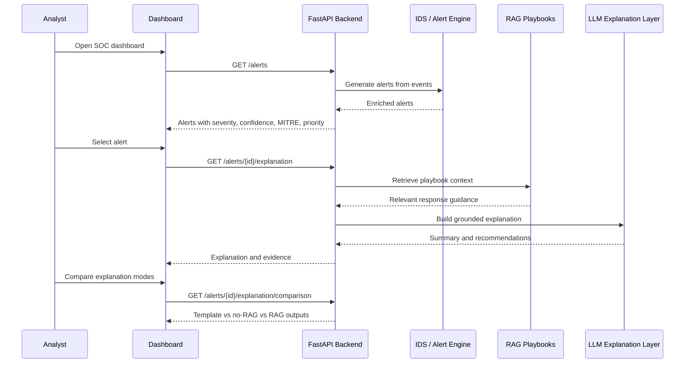

# Architecture Diagrams

These Mermaid diagrams can be used in the thesis, slides, or documentation. They describe the research prototype at three levels: system architecture, evaluation pipeline, and SOC analyst workflow.

## 1. System Architecture

## 2. Data And Model Evaluation Pipeline

## 3. Alert Explanation And LLM Evaluation Pipeline

## 4. SOC Analyst Workflow

## Thesis Figure Usage Notes

- Use **System Architecture** in Chapter 3: Proposed System.
- Use **Data And Model Evaluation Pipeline** in Chapter 4 or 5: Implementation and Experiments.
- Use **Alert Explanation And LLM Evaluation Pipeline** in Chapter 5: LLM/RAG evaluation.
- Use **SOC Analyst Workflow** in the demo slides to explain the end-to-end analyst interaction.

## Scope Boundary For Figures

The diagrams intentionally show an offline research prototype. They do not claim production realtime packet capture, automatic containment, or full SIEM/SOAR integration.
